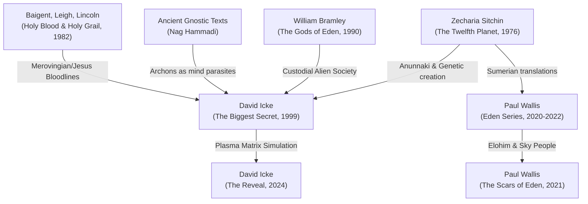
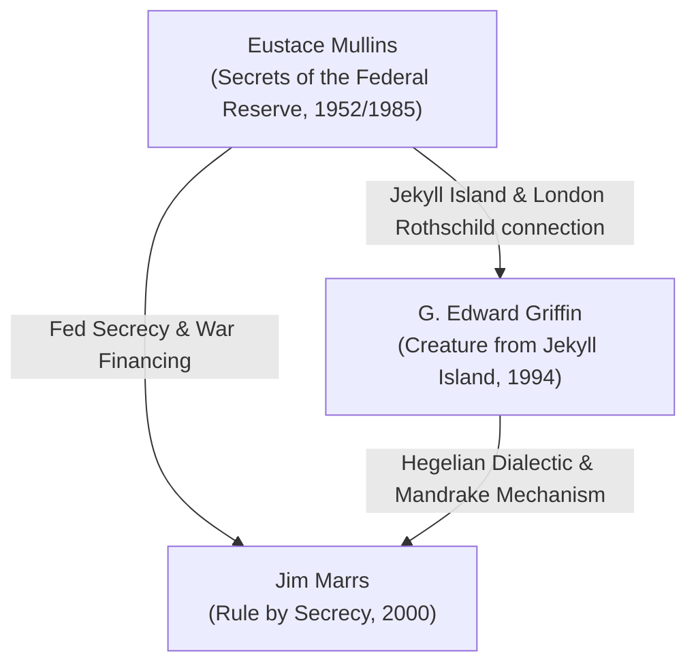
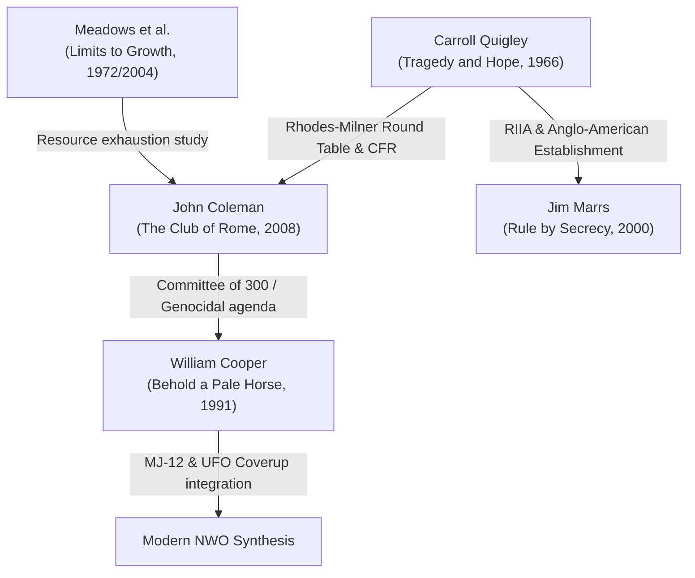

## Overview

The literature of alternative history, ancient astronaut theories, and New World Order conspiracies is highly cumulative. Rather than developing in isolation, these frameworks are built upon a series of key "primary" texts or historical disclosures that subsequent authors borrowed, expanded, and synthesized. Tracing this lineage reveals how diverse strands—such as Sumerian translation, central banking history, and British imperial politics—fused into modern alternative narratives.

---

## 1. The Ancient Astronaut & Reptilian Bloodline Lineage

This branch traces the evolution of claims regarding extraterrestrial intervention in human genesis and governance:

* **The Sitchin Foundation:** Zecharia Sitchin’s **[[The Twelfth Planet (Sitchin)]]** established the core thesis of the *Anunnaki* (the Nefilim from the planet Nibiru) genetically modifying *Homo erectus* to create a gold-mining workforce, interpreting the *Enuma Elish* as physical cosmology.
* **The Bramley Synthesis:** William Bramley’s **[[The Gods of Eden (Bramley)]]** introduced the concept of the *Custodial society*—a predatory alien hierarchy that deliberately sows religious and political conflict to keep humanity divided and enslaved.
* **The Icke Consolidation:** David Icke’s **[[The Biggest Secret (Icke, 1999)]]** fused Sitchin's Anunnaki and Bramley's Custodians with the dynastic genealogy of **[[The Holy Blood and the Holy Grail (Baigent, Leigh, Lincoln 1982)]]**, proposing that these extraterrestrials are shape-shifting, interdimensional reptilians who rule the planet through specific interbred bloodlines (e.g., the Merovingians and the House of Windsor). 
* **The Gnostic Turn:** In later works like **[[Everything You Need to Know But Have Never Been Told (Icke, 2018)]]** and **[[The Reveal (Icke)]]**, Icke integrated Nag Hammadi Gnosticism, aligning his reptilians with the *Archons* (sub-deities of a false demiurge, Yaldabaoth) who trap human souls in a holographic matrix.

---

## 2. The Banking Cartel & Federal Reserve Lineage

This branch traces the development of claims regarding the engineered control of national currencies:

* **The Mullins Disclosures:** Eustace Mullins' **[[Secrets of the Federal Reserve: The London Connection (Mullins)]]** represents the foundational investigative text. It documented the secret 1910 Jekyll Island meeting, identified the Wall Street and European banking houses behind the Federal Reserve Act of 1913, and claimed the Fed is a private cartel designed to orchestrate depressions and fund world wars.
* **The Griffin Popularization:** G. Edward Griffin’s **[[The Creature from Jekyll Island (Griffin)]]** expanded Mullins' research for a broader audience. Griffin added economic theory—specifically detailing the *Mandrake Mechanism* (fractional-reserve money creation from debt) and placing the banking cartel within a larger geopolitical thesis involving Cecil Rhodes' Round Table groups and the Hegelian Dialectic (engineered conflict).
* **The Marrs Integration:** Jim Marrs in **[[Rule by Secrecy (Marrs)]]** merged this financial critique directly with esoteric history, tracing the banking cartel's lineage backward through the Illuminati, the Knights Templar, and ultimately Sitchin's Sumerian Anunnaki.

---

## 3. The New World Order & Secret Society Lineage

This branch traces how historical records of elite organizations evolved into modern conspiracy frameworks:

* **The Quigley Record:** Carroll Quigley’s scholarly volume **[[Tragedy and Hope (Quigley)]]** is the ultimate primary source. As an academic historian with access to their archives, Quigley confirmed the existence of an elite, secret Anglo-American network founded by Cecil Rhodes (the Round Table Group) that established the Council on Foreign Relations (CFR) and Royal Institute of International Affairs (RIIA) to shape global policy.
* **The Coleman Extrapolation:** John Coleman’s **[[Conspirators' Hierarchy: The Story of the Committee of 300 (Coleman)]]** and **[[The Club of Rome (Coleman)]]** took the organizations documented by Quigley, as well as the resource depletion studies of **[[The Limits to Growth (Meadows et al.)]]**, and recast them as a highly centralized, malevolent shadow government (the "Committee of 300" or "Olympians") operating under a deliberate depopulation and zero-growth agenda.
* **The Cooper Synthesis:** William Cooper’s **[[Behold a Pale Horse (Cooper, 1991)]]** represents the definitive New World Order synthesis. Cooper merged Coleman's Committee of 300 and Quigley's CFR/Bilderberg networks with military/naval intelligence documents and the **MJ-12** UFO cover-up files, creating a unified theory that the NWO is an elite conspiracy using alien deception, engineered diseases, and FEMA control grids to establish a global dictatorship.

---

## Related Entities

* **Sources:** [[The Twelfth Planet (Sitchin)]] · [[The Gods of Eden (Bramley)]] · [[The Biggest Secret (Icke, 1999)]] · [[Behold a Pale Horse (Cooper, 1991)]] · [[Secrets of the Federal Reserve: The London Connection (Mullins)]] · [[The Creature from Jekyll Island (Griffin)]] · [[The Club of Rome (Coleman)]] · [[Tragedy and Hope (Quigley)]] · [[Rule by Secrecy (Marrs)]]
* **Concepts:** [[Round Table Group (Rhodes-Milner secret society)]] · [[Concept: The Matrix (Icke)]] · [[The London Connection]] · [[The Mandrake Mechanism]] · [[Concept: New World Order (Cooper)]] · [[The powerful ones (Wallis's plural elohim)]]
